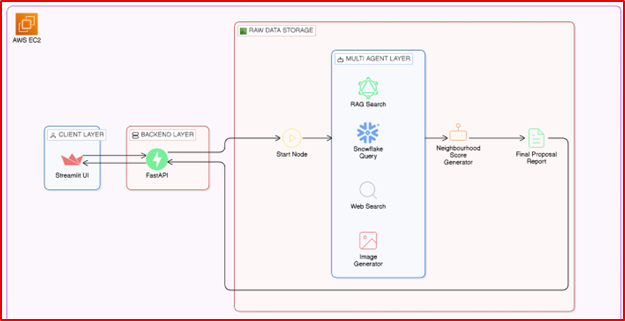
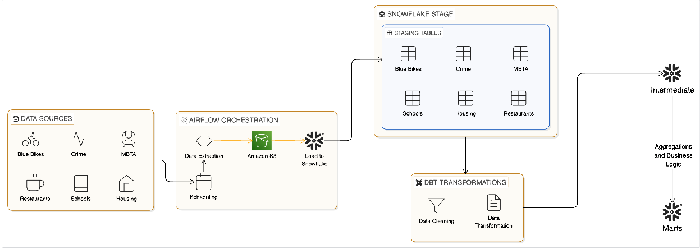

**NeighbourWise AI 🏙️**

DAMG7374 – Generative AI in Data Engineering
NeighbourWise AI is a Boston neighborhood intelligence platform that integrates multi-domain data pipelines to power a GenAI-driven relocation assistant.

**🚀 Overview**

This project ingests, transforms, and models data across key domains influencing relocation decisions:

Crime & Safety
Housing / Property Assessment
Transit (MBTA)
Blue Bikes
Schools
Restaurants (Yelp API)
Healthcare

The system enables proximity-based scoring and explainable neighborhood recommendations.

## 🧠 System Architecture (GenAI Application Layer)

This diagram shows the end-to-end application architecture including the client UI, backend APIs, multi-agent layer, and scoring engine.

### Key Components

- **Client Layer** → Streamlit UI for user interaction  
- **Backend Layer** → FastAPI services  
- **Multi-Agent Layer**
  - RAG Search
  - Snowflake Query Agent
  - Web Search
  - Image Generator
- **Neighborhood Score Generator**
- **Final Proposal Report Generator**

---

## 🏗️ Data Engineering Architecture

This diagram shows the full data pipeline from ingestion to transformation and marts.

### Pipeline Flow

Data Sources → Airflow → AWS S3 → Snowflake Stage → dbt Transformations → Intermediate → Marts  

**⚙️ Tech Stack**

Apache Airflow 2.8.1
AWS S3
Snowflake
dbt (dbt-snowflake)
Python
Yelp Fusion API
MBTA API's
Boston Open Data APIs

**🔄 Key Engineering Highlights**

Built production-style Airflow DAGs with scheduling & incremental loading
Implemented pagination logic for large APIs (247K+ crime records)
Designed retry + exponential backoff for unstable endpoints
Overcame Yelp API 1,000-record cap using geographic chunking + category-based extraction
Standardized and cleaned datasets in dbt transformation layer
Prepared geo-validated datasets for proximity-based GenAI scoring

**📊 Data Volume**

Crime: 247,672 records
Housing: 184,552 records
Schools: 2,448 records
Blue Bikes: 572 stations
Restaurants & MBTA: API-driven extraction with deduplication
Healthcare: 3435 records

**🎯 Goal**

To build a scalable, explainable, multi-domain data platform that powers intelligent, personalized neighborhood recommendations.

