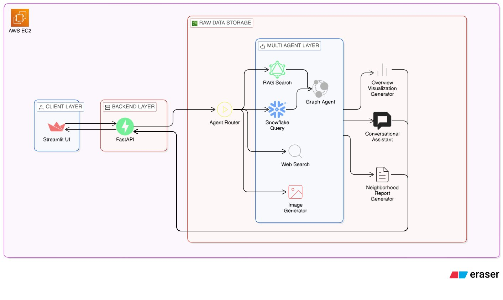
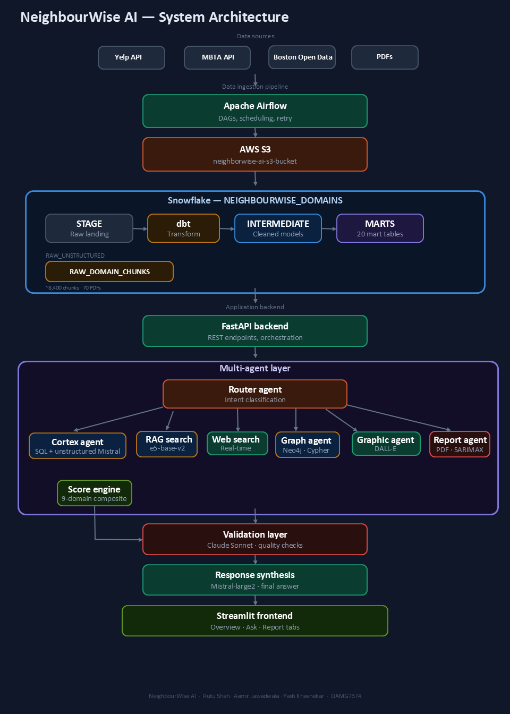
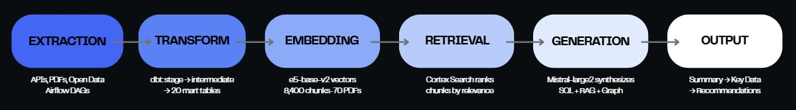

<div align="center">

# NeighbourWise AI

### Greater Boston Neighborhood Intelligence Platform

*Which neighborhood should I live in if I commute by transit, want low crime, need good schools, and care about restaurant variety?*

[](http://18.191.134.146:8501/)
[](#)
[](#)
[](#)
[](#)
[](#)

**DAMG 7374 — Gen AI with Applications in Data Engineering**
Northeastern University · Group 4 · Spring 2026

**Team:** Aamir Jawadwala · Yash Khavnekar · Rutu Shah

---

[Live App](http://18.191.134.146:8501/) · [Architecture](#system-architecture) · [Domains](#domains--coverage) · [Tech Stack](#tech-stack) · [Getting Started](#getting-started)

</div>

---

## About

NeighbourWise AI is a conversational neighborhood intelligence platform that scores **51 Greater Boston neighborhoods** across **9 livability domains** and surfaces insights through a multi-agent AI system. Users can ask natural-language questions, explore interactive domain dashboards, and generate magazine-quality PDF reports — all powered by Snowflake Cortex AI, Claude Sonnet, and a Neo4j knowledge graph.

### Key Numbers

| | |
|---|---|
| **51** neighborhoods scored | **9** livability domains |
| **356,852+** crime records | **169,641** housing records |
| **~8,400** RAG chunks across 70 PDFs | **7+** Airflow DAGs |
| **6** AI agents deployed | **13** FastAPI endpoints |
| **10-section** magazine PDF reports | **20-table** semantic model |

---

## System Architecture

*End-to-end application architecture: Client UI (Streamlit), Backend (FastAPI), Multi-Agent Layer with RAG Search, Snowflake Query, Web Search, Graph Agent, and Image Generator — producing Overview Visualizations, Conversational Responses, and Neighborhood Reports. Hosted on AWS EC2.*



---

## Engineering Diagram

*Full engineering architecture from data sources through Airflow ingestion, S3 storage, Snowflake warehouse (STAGE → dbt → INTERMEDIATE → MARTS), RAG corpus, FastAPI backend, multi-agent layer (Cortex, RAG, Web Search, Graph, Graphic, Report agents), validation, response synthesis, and Streamlit frontend.*



---

## Data Flow

*End-to-end data flow: Extraction → Transform → Embedding → Retrieval → Generation → Output.*



---

## Domains & Coverage

| Domain | Records | Scoring Signals | Key Sources |
|--------|---------|-----------------|-------------|
| **Crime & Safety** | 356,852+ | Violent rate, density, property rate, severity, YoY trend, night crime | Analyze Boston, Cambridge Open Data, Somerville Socrata, FBI |
| **Housing** | 169,641 | Affordability index, price distribution, property characteristics | Boston Open Data, Property Assessment |
| **Transit (MBTA)** | ~500 route-stops | Route count, tiered caps (bus/subway/CR), connectivity scoring | MBTA API v3 |
| **Bluebikes** | 572 stations | Station density, dock count, capacity tiers | Boston Open Data |
| **Healthcare** | 1,398 facilities | Facility density, contact quality, type diversity, bed capacity | Mass DPH, OpenStreetMap Overpass API |
| **Schools** | 2,448 | Count, mix, level diversity, density | MassGIS Shapefile |
| **Restaurants** | 1,000+ | Density, avg rating, cuisine diversity, price distribution | Yelp Fusion API, Harvard BARI |
| **Universities** | Boston area | Presence, density, level, research, diversity, housing | US Dept. of Education College Scorecard |
| **Grocery** | 15,335 | Store types, density, pct essential | MassGIS/Infogroup |

**Master Score Weights:** Safety 20% · Transit 20% · Housing 15% · Grocery 10% · Healthcare 10% · Schools 10% · Restaurants 10% · Universities 5%

---

## Tech Stack

| Layer | Technology | Purpose |
|-------|-----------|---------|
| Orchestration | Apache Airflow 2.8.1 (Docker) | DAG-based scheduling for 7+ pipelines |
| Storage | AWS S3 | Landing zone between ingestion and warehouse |
| Data Warehouse | Snowflake | STAGE → INTERMEDIATE → MARTS with native GEOGRAPHY and VECTOR types |
| Transformation | dbt (dbt-snowflake) | SQL transformations with custom schema routing |
| AI — Generation | Claude Sonnet (Anthropic) | Primary natural language response generation |
| AI — Validation | GPT-4o (OpenAI) | Cross-model validation independent of generation |
| AI — SQL + RAG | Snowflake Cortex | Cortex Analyst, Cortex Search, Cortex COMPLETE (mistral-large2), EMBED_TEXT_768 (e5-base-v2) |
| Knowledge Graph | Neo4j AuraDB | Cross-domain graph queries via Cypher + LangGraph |
| Backend | FastAPI (Python) | REST API with guardrails, cost tracking, report generation |
| Frontend | Streamlit | 3-tab UI with pydeck maps, Altair charts, domain deep-dives |
| ML / Statistics | scikit-learn, statsmodels | DBSCAN spatial clustering (haversine), SARIMAX forecasting |
| Web Search | Serper API | Real-time queries outside Snowflake data |
| Image Generation | DALL-E 3 HD | AI-generated neighborhood perspectives |
| Geocoding | Nominatim (OpenStreetMap) | Free geocoding with bounding box validation |

---

## Agent Architecture

The platform routes every query through a **Router Agent** that classifies intent and dispatches to specialized agents:

| Agent | Technology | What It Does |
|-------|-----------|-------------|
| **Cortex SQL Agent** | Cortex Analyst + Semantic Model YAML | Queries 20 Snowflake mart tables via natural language |
| **RAG Agent** | Cortex Search + e5-base-v2 | Hybrid retrieval (65% vector + 35% keyword) from ~8,400 chunks |
| **Graph Agent** | LangGraph + Neo4j AuraDB | Cross-domain relationship queries with parallel fan-out |
| **Web Search Agent** | Serper + Claude + GPT-4o | Real-time web queries for data outside Snowflake |
| **Report Agent** | ReportLab + Altair + Matplotlib | 10-section magazine-quality PDF per neighborhood |
| **Graphic Agent** | Altair + Plotly + DALL-E 3 | 6 chart types + 4 AI-generated images per neighborhood |
| **Validator** | Claude Sonnet + GPT-4o | Hallucination detection, format compliance, accuracy checks |

---

## Snowflake Schema

```
NEIGHBOURWISE_DOMAINS
├── STAGE              → STG_* tables (raw data from Airflow DAGs)
├── INTERMEDIATE       → INT_* tables (cleaned, geocoded, enriched)
├── MARTS              → MRT_* tables (51 rows each, scores + grades + narratives)
├── ANALYTICS          → NEIGHBORHOOD_MASTER_SCORE (weighted composite)
├── RAW_UNSTRUCTURED   → RAW_DOMAIN_CHUNKS (768-dim vector embeddings)
├── CRIME_ANALYSIS     → CA_CRIME_* (DBSCAN clusters, SARIMAX forecasts)
└── HEALTHCARE_ANALYSIS → HA_HEALTHCARE_* (facility clusters, access profiles)
```

---

## Application Features

### Overview Tab — 3 Modes
- **Home:** KPI cards, safety choropleth map, affordability bar, transit pills, livability heatmap
- **Domain Deep-Dive:** Safety (DBSCAN hotspots, SARIMAX forecasts), Healthcare (7 visualizations including choropleth + scatter overlay)
- **Neighborhood Profile:** Hero card, 9-domain scorecard, ranking vs all 50 neighbors

### Ask Tab
Natural language Q&A with routing metadata, SQL expanders, RAG source citations, and intent badges.

### Report Tab
On-demand magazine-quality PDF generation with 10 sections: cover page, executive summary, domain scorecard, radar chart, bar charts, neighborhood comparison, crime forecast, per-domain narratives, lifestyle context, and recommendations.

---

## Getting Started

### Prerequisites
- Python 3.11+
- Docker & Docker Compose
- Snowflake account with Cortex enabled
- API keys: Anthropic, OpenAI, Serper

### Local Development

```bash
# Clone the repository
git clone https://github.com/NeighbourWise-AI/neighbourwise.ai_version1.git
cd neighbourwise.ai_version1

# Set up environment
cp .env.example .env
# Edit .env with your credentials

# Start with Docker
docker compose up --build -d

# Access the app
# Frontend: http://localhost:8501
# Backend:  http://localhost:8001/docs
```

### dbt Setup (Windows)

```powershell
# Activate the dbt-specific Python environment
deactivate
.\.venv-dbt\Scripts\Activate.ps1
cd dbt\neighborhood_dbt

# Run models (case-sensitive names)
dbt run --select MRT_NEIGHBORHOOD_SAFETY
dbt run --select NEIGHBORHOOD_MASTER_SCORE  # Always run last
```

### RAG Pipeline

```bash
# Download a policy PDF
python scripts/neighbourwise_rag.py download --domain HEALTHCARE --url <pdf_url>

# Chunk, embed, and load into Snowflake
python scripts/neighbourwise_rag.py load --domain HEALTHCARE

# Search the corpus
python scripts/neighbourwise_rag.py search --query "hospital access in Boston"
```

---

## Deployment

The application is deployed on **AWS EC2** (t3.large, x86_64) with Docker Compose.

**Live URL:** [http://18.191.134.146:8501/](http://18.191.134.146:8501/)

> **Note:** Do not use Graviton instances (t4g, m6g) — `vl_convert` has broken text rendering on ARM64 Linux. Standard x86_64 instances (t3, t2, m5, c5) work correctly.

---

## Project Structure

```
neighbourwise.ai_version1/
├── Airflow/dags/                    # 7+ Airflow DAG files
├── dbt/neighbourhood_dbt/           # dbt models (STG → INT → MRT)
│   ├── models/stage/
│   ├── models/intermediate/
│   ├── models/marts/
│   └── macros/generate_schema_name.sql
├── scripts/
│   ├── neighbourwise_rag.py         # RAG pipeline (download/load/search)
│   ├── neighbourwise_semantic_model.yaml
│   ├── upload_yaml.py
│   └── extract_osm_healthcare.py
├── neighbourwise_fastapi.py         # FastAPI backend (13 endpoints)
├── overview_endpoints.py            # Overview domain endpoints
├── neighbourwise_app.py             # Streamlit frontend
├── neighbourwise_validator.py       # Validator agent
├── router_agent.py                  # Query routing
├── Graph_agent.py                   # Neo4j LangGraph agent
├── report_agent.py                  # Magazine PDF generator
├── graphic_agent.py                 # Chart + DALL-E agent
├── crime_hotspot_analysis.py        # DBSCAN + SARIMAX
├── docs/diagrams/                   # Architecture diagrams
│   ├── System_Architecture_Diagram.png
│   ├── Engineering_Diagram.png
│   └── Data_Flow_Diagram.png
├── docker-compose.yml
├── Dockerfile.backend
├── Dockerfile.frontend
├── requirements.txt
└── README.md
```

---

## Scoring Methodology

| Domain | Method | Grade Labels |
|--------|--------|-------------|
| Safety | Z-score (6 signals) | Excellent · Good · Moderate · High Concern |
| Transit | Route-based + tiered caps v3 | Excellent · Good · Moderate · Limited |
| Healthcare | 4-component composite | A · B · C · D · F · No Data |
| Restaurants | Z-score (mean=50, std=15) | Excellent · Good · Moderate · Limited |
| Universities | 6-factor additive | Excellent · Good · Moderate · Limited · None |
| Grocery | Additive (types + density) | Well Stocked · Adequate · Moderate · Food Desert |
| Housing | Affordability-based | Affordable · Average · Below Average |
| **Master Score** | **Weighted composite** | **Top Pick · Solid Choice · Moderate Pick · Limited Appeal** |

---

## Acknowledgments

- **Course:** DAMG 7374 — Generative AI with Applications in Data Engineering
- **University:** Northeastern University, Spring 2026
- **Data Sources:** Boston Open Data, MBTA API, Yelp Fusion, US College Scorecard, MassGIS, Massachusetts DPH, Harvard BARI, FBI CDE, OpenStreetMap

---

<div align="center">

**[Try the Live App →](http://18.191.134.146:8501/)**

*NeighbourWise AI · DAMG 7374 · Northeastern University · April 2026*

</div>
