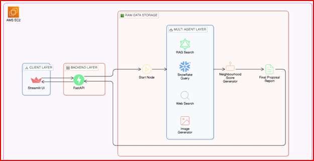
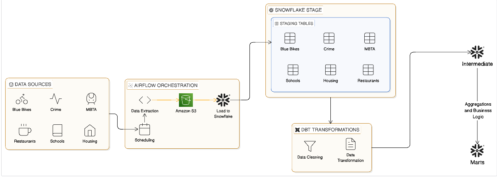

<div align="center">

# NeighbourWise AI

### Neighbourhood Intelligence for Boston

[](https://python.org)
[](https://snowflake.com)
[](https://getdbt.com)
[](https://airflow.apache.org)
[](https://streamlit.io)
[](https://neo4j.com)
[](https://fastapi.tiangolo.com)

**DAMG7374 · Generative AI in Data Engineering · Northeastern University**

*Helping people make smarter relocation decisions by turning fragmented public data into conversational, data-backed neighborhood insights across 51 Greater Boston locations.*

---

</div>

## The Problem

Choosing where to live in Boston means juggling fragmented data across dozens of sources — crime stats at the precinct level, healthcare access at the city level, school ratings on one website, transit scores on another. No single platform connects these dimensions or answers complex, multi-faceted questions like *"Is Allston safe, affordable, and close to good hospitals?"*

## What We Built

NeighbourWise AI is a conversational intelligence platform that integrates **9 data domains** across **51 Greater Boston neighborhoods** into a unified, GenAI-powered relocation assistant. Users ask natural-language questions and receive synthesized, data-backed answers — combining structured database queries, unstructured document search, knowledge graph traversal, web search, and AI-generated visuals into a single coherent response.

---

## System Architecture

*End-to-end application architecture: Client UI (Streamlit), Backend (FastAPI), Multi-Agent Layer, and Output Generators.*

<div align="center">

</div>

### Data Pipeline Architecture

*Full data pipeline from ingestion to transformation and marts.*

<div align="center">

</div>

---

## Domains & Coverage

| Domain | Records | Scoring Signals | Key Sources |
|:---|---:|:---|:---|
| Crime & Safety | 247,672 | Violent rate, density, property rate, severity, YoY trend, night crime | Analyze Boston, Cambridge Open Data, Somerville Socrata, FBI |
| Housing | 184,552 | Rent, affordability, pricing trends | Boston Open Data, Property Assessment |
| Healthcare | 3,435 | Facility density, contact quality, type diversity | Health of Boston, Children's CHNA, CMR Regulations |
| Schools | 2,448 | K-12 ratings, proximity, performance | Boston Open Data |
| Bluebikes | 572 stations | Station density, usage patterns | Bluebikes System Data |
| Transit | API-driven | MBTA access, commute times | MBTA API |
| Restaurants | API-driven | Yelp ratings, cuisine diversity, inspections | Yelp Fusion API, Harvard BARI |
| Universities | API-driven | Scorecard metrics, enrollment, proximity | US Dept. of Education College Scorecard |
| Grocery | API-driven | 4-tier access classification, essential food source density | Overpass API (OpenStreetMap) |

**Unstructured corpus:** ~8,400 document chunks across 70 policy and regulatory PDFs spanning all domains — loaded into Snowflake Cortex Search with e5-base-v2 embeddings.

---

## Multi-Agent System

The platform uses a **multi-agent orchestration architecture** where a central Router Agent classifies each user query by intent and routes it to one or more specialized agents. Every agent's output passes through a Universal Validator before synthesis.

| Agent | Role | Technology |
|:---|:---|:---|
| **Router Agent** | Intent classification and query routing | Cortex COMPLETE (Mistral-large2) |
| **Cortex Agent** | SQL generation against Snowflake mart tables | Cortex Analyst + Semantic Model YAML |
| **RAG Search** | Unstructured document search across policy/regulatory corpus | Cortex Search Service (e5-base-v2) |
| **Graph Agent** | Entity relationship traversal — proximity, connections, dependencies | Neo4j + Cypher |
| **Web Search Agent** | Real-time external information retrieval | Web Search API |
| **Graphic Agent** | AI-generated charts, maps, and infographics | DALL-E |
| **Report Agent** | Comprehensive PDF reports with SARIMAX forecasts, charts, and AI narratives | Cortex COMPLETE + PDF generation |
| **Universal Validator** | Hallucination detection, format compliance, accuracy checks on all outputs | Claude Sonnet |

**Scoring Engine:** Each domain produces a normalized 0–100 score per neighborhood. Domain scores are weighted and combined into a composite neighborhood score. Every score is accompanied by an LLM-generated plain-English narrative (Snowflake Cortex, Mistral-large) translating numbers into actionable insights.

---

## Analytical Methods

**Two-Pass DBSCAN** — Single-pass DBSCAN forces a tradeoff between broad zones and pinpoint precision. Two passes on 270K+ geocoded incidents solve this: Pass 1 (ε ≈ 200m, min_samples = 50) identifies macro-level hotspot regions; Pass 2 (ε ≈ 75m, min_samples = 15) reveals micro-clusters nested within them. Applied across crime, grocery (food desert detection), and healthcare (facility concentration mapping).

**SARIMAX(1,1,1)(1,1,1,12)** — Seasonal differencing at s=12 captures Boston's annual cycles — crime peaks in summer, dips in winter. 12-month rolling forecasts with 95% confidence intervals add a forward-looking dimension to every neighborhood profile.

**Multi-Source Integration** — Four crime data sources with different granularity (incident-level from Analyze Boston, Cambridge, and Somerville alongside annual FBI aggregates for 11 suburban cities). A two-track scoring system with redistributed signal weights enables comparison across all 51 locations.

---

## Tech Stack

| Layer | Technologies |
|:---|:---|
| **Orchestration** | Apache Airflow 2.8.1 (Docker) |
| **Storage** | AWS S3, Snowflake |
| **Transformation** | dbt (dbt-snowflake) |
| **GenAI / LLM** | Snowflake Cortex (Cortex Analyst, Cortex Search, Cortex COMPLETE), Mistral-large2, Claude Sonnet, DALL-E |
| **Knowledge Graph** | Neo4j |
| **Backend** | FastAPI, Python |
| **Frontend** | Streamlit |
| **ML / Stats** | scikit-learn, statsmodels (DBSCAN, SARIMAX) |
| **Data Sources** | Yelp Fusion API, MBTA APIs, Boston Open Data, Overpass API, US College Scorecard, Mass.gov, Harvard BARI |

---

## Engineering Highlights

Production-grade Airflow DAGs with scheduling, incremental loading, retry logic, and exponential backoff for unstable endpoints. Pagination logic handles large-volume APIs (247K+ crime records). Yelp API's 1,000-record cap was overcome using geographic chunking combined with category-based extraction. Datasets are standardized and geo-validated in the dbt transformation layer across staging, intermediate, and mart layers (20 mart tables, 19 defined relationships). The unstructured pipeline processes dense regulatory PDFs with robust text cleaning — backslash handling, non-printable character filtering, and 2,000-char chunk truncation. Deterministic query routing is achieved via temperature=0 LLM classification plus keyword overrides, eliminating non-deterministic behavior on ambiguous boundary queries. All neighborhoods are stored and queried as uppercase in Snowflake, with full table paths enforced in all generated SQL. `COALESCE` and left-join patterns against the master location table guarantee all 51 neighborhoods appear in every aggregation.

---

## Repository Structure

```
neighbourwise.ai_version1/
├── airflow/                    # Airflow DAGs and Docker configuration
├── dbt/
│   └── neighborhood_dbt/       # dbt project (staging → intermediate → marts)
├── neighbourwise-agents/
│   ├── router_agent.py         # Intent classification & multi-agent routing
│   ├── cortex_agent.py         # SQL agent via Snowflake Cortex Analyst
│   ├── Graph_agent.py          # Neo4j knowledge graph agent
│   ├── web_search_agent.py     # Real-time web search agent
│   ├── graphic_agent.py        # DALL-E image generation agent
│   ├── report_agent.py         # PDF report generation with SARIMAX
│   ├── universal_validator.py  # Output validation layer
│   ├── validator_agent.py      # Claude Sonnet validation agent
│   ├── neighborwise_app.py     # Streamlit frontend
│   ├── neighborwise_fastapi.py # FastAPI backend
│   └── shared/                 # Shared utilities and configurations
├── scripts/
│   ├── neighbourwise_rag.py    # PDF ingestion and embedding pipeline
│   ├── neighbourwise_semantic_model.yaml
│   └── upload_yaml.py          # Semantic model upload to Snowflake stage
└── docs/                       # Architecture diagrams and documentation
```

---

## Getting Started

**Prerequisites:** Python 3.10+, Snowflake account, AWS S3 bucket, Neo4j instance, Docker (for Airflow)

1. **Clone the repository**
   ```bash
   git clone https://github.com/NeighbourWise-AI/neighbourwise.ai_version1.git
   cd neighbourwise.ai_version1
   ```

2. **Set up the virtual environment**
   ```bash
   python -m venv .venv
   source .venv/bin/activate        # macOS/Linux
   .\.venv\Scripts\Activate.ps1     # Windows PowerShell
   pip install -r requirements.txt
   ```

3. **Configure environment variables** — Create a `.env` file with your Snowflake, AWS, Neo4j, and API credentials.

4. **Run the data pipeline**
   ```bash
   # Start Airflow (Docker)
   docker-compose up -d

   # Run dbt transformations
   cd dbt/neighborhood_dbt
   dbt run
   ```

5. **Launch the application**
   ```bash
   # Start the FastAPI backend
   uvicorn neighborwise_fastapi:app --reload

   # Start the Streamlit frontend
   streamlit run neighborwise_app.py
   ```

---

## Team

| | Name |
|:---|:---|
| 👤 | **Aamir Jawadwala** |
| 👤 | **Rutu Shah** |
| 👤 | **Yash Khavnekar** |

---

<div align="center">

*Built as part of DAMG7374 — Generative AI in Data Engineering at Northeastern University*

</div>
